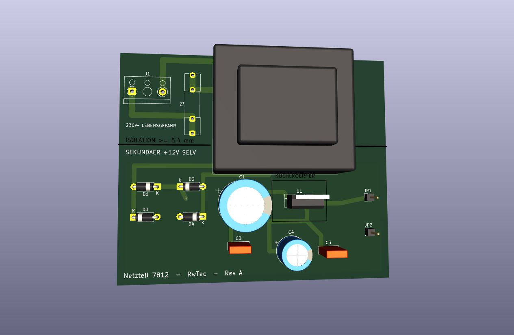
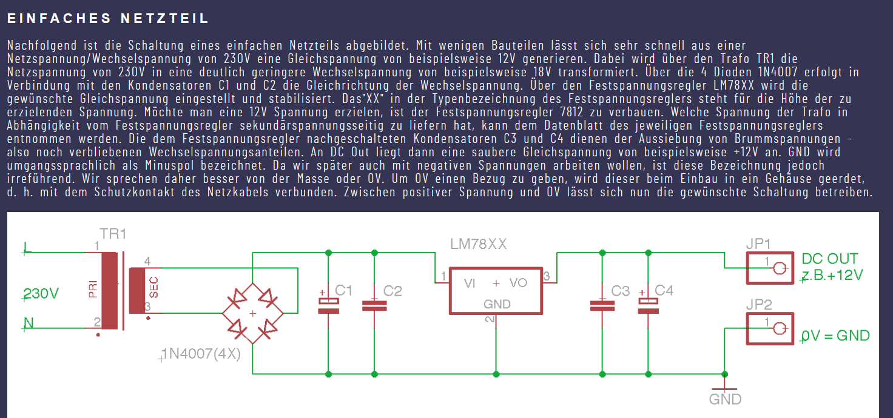

# KiCadPlatine — Netzteil 230 V~ → +12 V, vollständig von einer KI entwickelt

Ein KiCad-8-Projekt für ein einfaches Linearnetzteil mit dem Festspannungsregler **7812**.
Das Besondere daran ist nicht die Schaltung — die steht in jedem Lehrbuch — sondern **wie
sie entstanden ist**: Der komplette Entwurf wurde von der KI **Claude** (Anthropic,
über Claude Code) erstellt. Vorgabe war ein einziges Bild.



---

## 🤖 Was die KI gemacht hat

**Alles zwischen Vorgabe und fertigen Produktionsdaten — in rund 55 Minuten:**

| Schritt | Ergebnis |
|---|---|
| Bibliotheken analysiert | Symbole und Footprints geprüft statt geraten |
| **Schaltplan** entworfen | 14 Bauteile, 8 Netze, `.kicad_sch` |
| **Bauteilwerte berechnet** | Trafo, Ladeelko, Sicherung, Verlustleistung |
| **Platine layoutet** | Bauteilplatzierung, Primär/Sekundär getrennt |
| **Vollständig geroutet** | 50 Leiterbahnsegmente, nur 2 Durchkontaktierungen |
| **Massefläche** angelegt | bewusst nur sekundärseitig |
| **Sicherheitsregel** definiert | eigene DRC-Regel: 6,4 mm Kriechstrecke |
| **Fehler gefunden und behoben** | u. a. zwei echte Kurzschlüsse |
| **Produktionsdaten** erzeugt | Gerber, Bohrdatei, Stückliste, PDFs |

**Was der Mensch beigetragen hat:** das Vorgabebild, zwei Entscheidungen
(Trafo auf der Platine statt extern, 0,5 A Ausgangsstrom) sowie Durchsicht und Freigabe.
Keine einzige Leiterbahn wurde von Hand gezogen.

Der Entwurf entstand **nicht durch Klicken in der KiCad-Oberfläche**, sondern über
Python-Generatorskripte (`kiutils`, `pcbnew`, `kicad-cli`). KiCad selbst diente als
Prüfinstanz. Das ganze Projekt lässt sich mit einem Befehl reproduzieren:

```bash
python build_all.py
```

## 📋 Die Vorgabe

Mehr als dieses Bild und der Satz *„möchte mit KiCad eine Platine gebaut haben mit
Festspannungsregler 7812 sowie in der Bilddatei beschrieben"* gab es nicht:



## ✅ Geprüfter Stand

| Prüfung | Ergebnis |
|---|---|
| ERC (Schaltplanprüfung) | **0 Verstöße** |
| DRC (Designregelprüfung) | **0 Verstöße**, 0 unverbundene Anschlüsse |
| Kriechstrecke Primär ↔ Sekundär | **≥ 6,4 mm**, per eigener Regel nachgerechnet |
| Platinengröße | **92,2 × 77,2 mm**, 2 Lagen, bedrahtet (THT) |

Die Prüfberichte [`erc.rpt`](Platine7812/erc.rpt) und [`drc.rpt`](Platine7812/drc.rpt)
liegen im Repository — der Stand ist also nachprüfbar, nicht nur behauptet.

Bewusst unter 100 × 100 mm: Unterhalb dieser Grenze fertigen die üblichen Anbieter
deutlich günstiger. Dafür wanderte die gesamte Sekundärseite unter den Trafo.

## 🔬 Was die KI beim Prüfen gefunden hat

Der interessanteste Teil des Projekts. KiCads Prüfwerkzeuge deckten Fehler auf, die im
Layout wie normale Linien aussehen:

- **Zwei echte Kurzschlüsse** — je eine Leiterbahn lief mitten durch ein fremdes Lötauge
  (Phase durch den Neutralleiter-Anschluss, Masse durch den Reglereingang).
- **Netzlose „Geisterpads"** — der mitgelieferte KiCad-Trafo-Footprint legt 12 Kupferpads
  an, benennt aber nur 4. Die übrigen 8 wären blanke Kupferinseln direkt neben 230 V~
  geworden. Daraus wurde ein eigener, sauberer 4-Pad-Footprint abgeleitet.
- **Zu enge Abstände bei Netzspannung** — die Netzklemme wurde daraufhin von 5,08 mm auf
  10 mm Raster getauscht.

## 💡 Zwei Werte, die von der Vorlage abweichen

Die KI hat nachgerechnet und zwei Angaben des Vorlagentexts bewusst geändert:

**Sekundärspannung 15 V~ statt 18 V~**

```
15 V~ → Scheitelwert 15 · √2                          = 21,2 V
        − 2 Diodenflussspannungen (2 · 0,7 V)         = 19,8 V
        − Brummspannung I·t/C = 0,5 A · 10 ms / 2200 µF = 2,3 V
        → am Reglereingang bleiben                    ≈ 17,5 V
```

Der 7812 braucht mindestens 14 V — 3,5 V Reserve bleiben. Die überschüssige Spannung
verheizt der Regler: mit 15 V~ sind das **3,3 W**, mit 18 V~ wären es **5,5 W** gewesen.

**Trafo 15 VA statt 10 VA** — bei Gleichrichtung mit Ladeelko fließt der Strom in kurzen
Spitzen; der Trafo-Effektivstrom ist rund 1,6…1,8 × der Gleichstrom. Für 0,5 A DC sind das
ca. 0,85 A. Ein 10-VA-Typ liefert bei 15 V nur 0,67 A und wäre überlastet.

## 📦 Inhalt

```
Platine7812/
  Platine7812.kicad_sch     Schaltplan
  Platine7812.kicad_pcb     Leiterplatte, fertig geroutet
  Platine7812.kicad_dru     eigene DRC-Regel (6,4 mm Isolation)
  Platine7812.pretty/       projekteigener Trafo-Footprint
  fertigung/                Gerber, Bohrdatei, ZIP, Stückliste, PDFs
  erc.rpt · drc.rpt         Prüfberichte
  README.md                 technische Doku mit Auslegungsrechnung

  build_all.py              erzeugt das komplette Projekt neu
  build_schematic.py        Schaltplan-Generator
  build_pcb.py              Platinen-Generator (Platzierung + Routing)
  make_trafo_footprint.py   eigener Trafo-Footprint
  setup_project.py          Netzklassen
  make_fabrication.py       Produktionsdateien

PlatineKi.md                Werkstattbericht über die Entstehung
```

Die technischen Details stehen in [`Platine7812/README.md`](Platine7812/README.md),
die Entstehungsgeschichte in [`PlatineKi.md`](PlatineKi.md).

## ⚠️ Sicherheitshinweis

> Die **Primärseite dieser Platine führt Netzspannung (230 V~)**. Nachbau, Inbetriebnahme
> und Messung nur durch entsprechend qualifizierte Personen, mit Trenntrafo und niemals bei
> offenem Gehäuse. Primär- und Sekundärseite sind galvanisch getrennt (SELV am Ausgang).

## 🔧 Vor einem Nachbau zu prüfen

1. **Trafo-Anschlussmaße** gegen das Datenblatt des tatsächlich beschafften 15-VA-Trafos
   abgleichen. Der Footprint ist vom generischen KiCad-Trafo 37 × 44 mm abgeleitet; nach
   oben sind nur 2,4 mm Luft zur Platinenkante.
2. **Kühlkörper** für U1 aussuchen (≤ 15 K/W). Die Fläche von 19 × 14 mm ist freigehalten.
   Ohne Kühlkörper schaltet der 7812 bei 3,3 W thermisch ab.

Das Projekt ist geprüft, aber **noch nicht als Hardware aufgebaut**.

## 📄 Lizenz

[MIT](LICENSE) — die Lizenz gilt für **alle Bestandteile** dieses Repositorys: die
Generatorskripte, die KiCad-Entwurfsdateien und die Produktionsdaten. Nachbauen,
verändern und weitergeben sind ausdrücklich erwünscht, auch kommerziell; der
Copyright-Hinweis muss erhalten bleiben.

Wie in der MIT-Lizenz festgehalten, erfolgt die Weitergabe **ohne jede Gewährleistung**.
Das ist hier mehr als eine Formalie: Die Platine führt Netzspannung und ist bislang
geprüft, aber nicht als Hardware aufgebaut. Wer sie nachbaut, trägt die Verantwortung
für die eigene Ausführung — siehe Sicherheitshinweis oben.

---

*KiCad 8.0.8 · kiutils / pcbnew / kicad-cli · Entwurf: Claude (Anthropic) via Claude Code · Rw*
